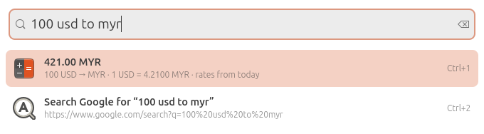
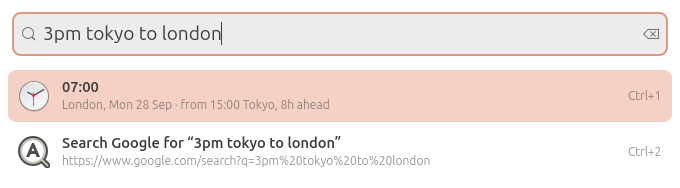
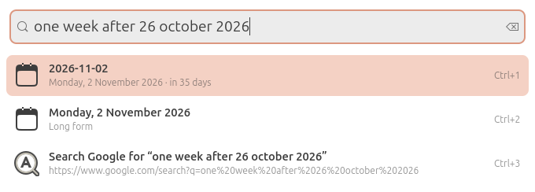
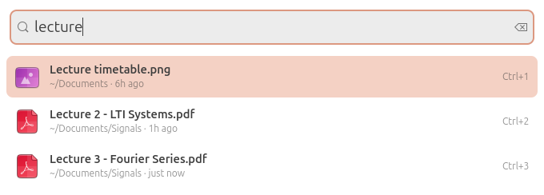
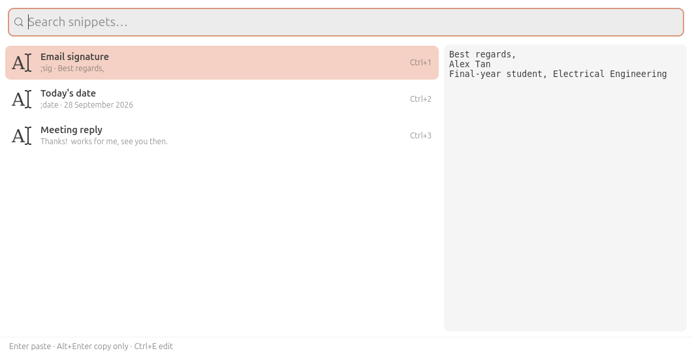
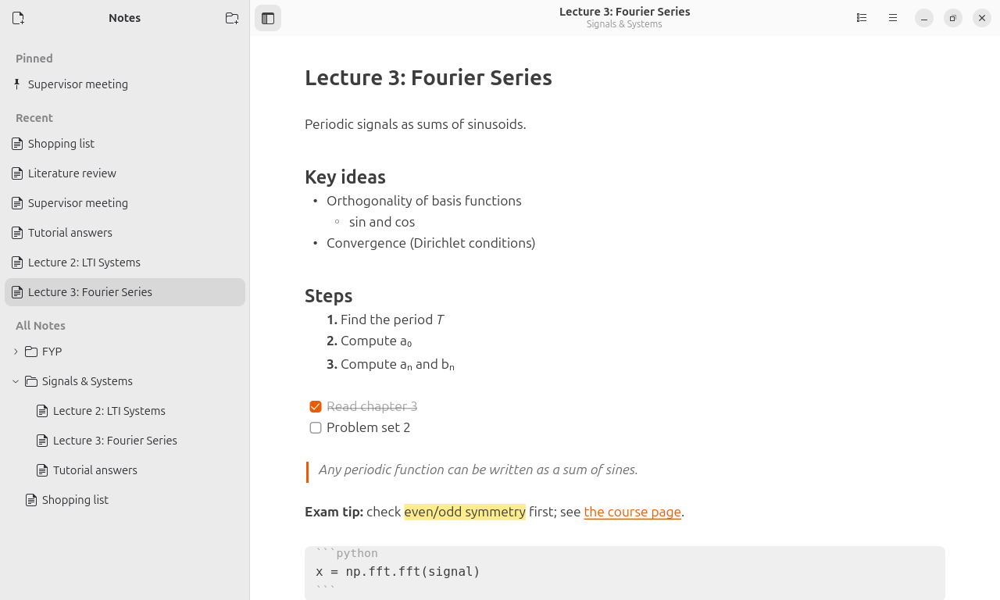
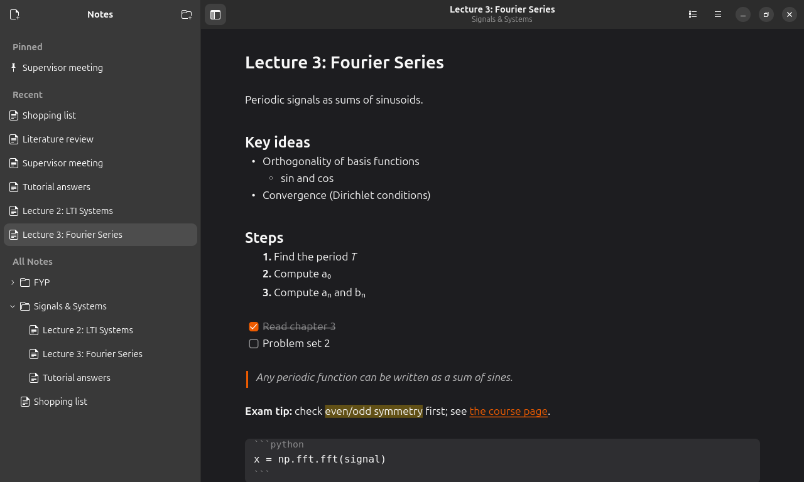
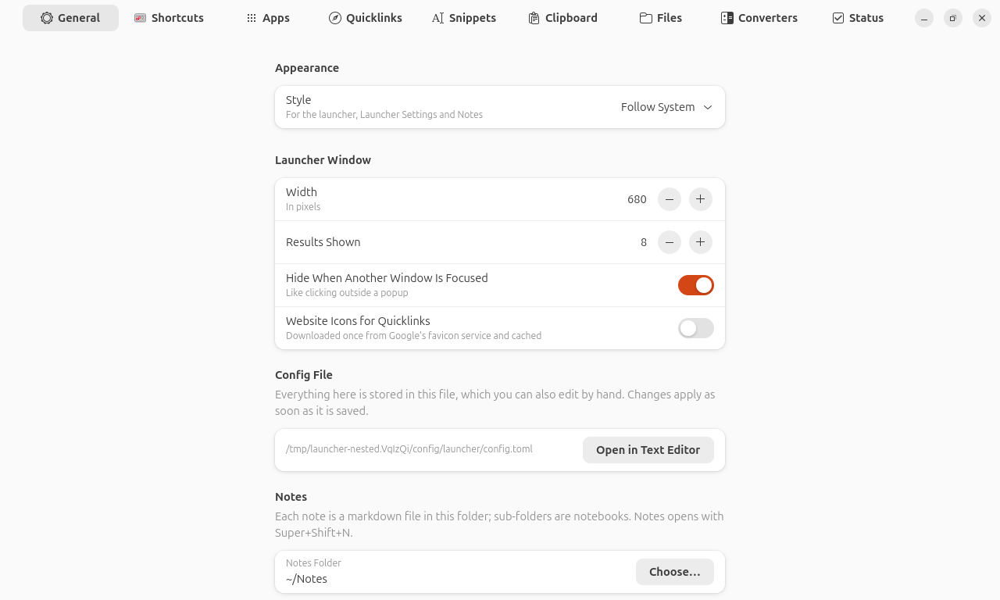
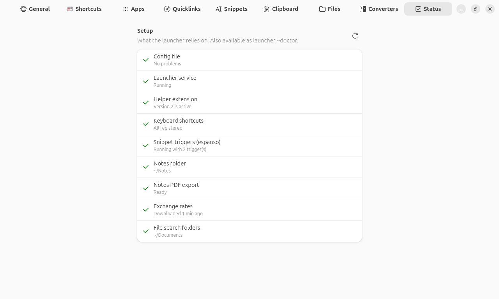

# Launcher

A keyboard launcher for GNOME on Wayland: apps, quicklinks and web search, file search,
clipboard history with paste-back, snippets, converters (dates, time zones,
currencies) and a markdown notes app that formats as you type.

It is a small set of features meant to work every time, not a plugin platform. Written
in Python with GTK 4 and libadwaita, plus a tiny GNOME Shell extension for the things
Wayland doesn't let apps do themselves (reading the clipboard, pasting into another
window).

<p align="center">
  
  
</p>

## Features

### Apps, quicklinks and web search
Fuzzy search over your apps (`vsc` finds Visual Studio Code) ranked by how often you use
them. Quicklinks open a URL; add `{query}` and an alias to make a search (`g cats`), or
`fallback = true` to offer "Search Google for …" under every search. Any app, quicklink
or snippet can have its own alias and global hotkey. `launcher --import-ulauncher`
converts Ulauncher's shortcuts.

### Converters
Typed straight into the main search, answered as you type, Enter copies, Alt+Enter pastes:

| Type | Get |
|---|---|
| `tomorrow`, `next friday`, `one week after 26 october 2026`, `christmas` | the date |
| `time in tokyo`, `3pm tokyo`, `3pm tokyo to london` | the time there |
| `100 usd`, `1.5k usd to jpy`, `50 eur in myr` | the amount, from daily rates cached for offline use |



### File search
Instant search over the folders you choose (default `~/Downloads` and `~/Documents`),
kept up to date as files arrive. Enter opens, Alt+Enter shows the file in its folder.



### Clipboard history
Text and images you copy, searchable, with a preview. Enter pastes the entry straight
into the window you came from (Ctrl+Shift+V in terminals). Pin what you reuse; copies
from password managers are never recorded; pause recording with one shortcut. Kept for
30 days / 500 entries by default, on your disk only.


### Snippets
Text you type often, pasted from the launcher, or expanded anywhere as you type a
trigger like `;sig` (through [espanso](https://espanso.org), which the launcher keeps
in sync). Placeholders: `{date:%d %B %Y}`, `{clipboard}` and `{cursor}`.



### Notes
A notes app for taking notes in class: `- ` becomes a bullet, `## ` a heading, `[] ` a
checkbox, `**bold**` turns bold, and the markdown symbols hide once you move to another
line. Each note is a plain `.md` file in `~/Notes`, with folders as notebooks, pinned and
recent notes in a sidebar you can hide (F9), an outline of the headings, pasted
screenshots, export to PDF, and autosave (a second after you stop typing, and whenever
you switch to another window). Notes also show up in the launcher's search.

<p align="center">
  
  
</p>

### Settings and setup check
Everything lives in `~/.config/launcher/config.toml`, which you can edit by hand or
through **Launcher Settings** (it keeps your comments, and refuses changes that would
break the file). Style can follow GNOME or be forced light or dark. The **Status** page,
also `launcher --doctor`, checks the whole setup and offers a fix for each problem; the
launcher shows serious ones in a banner, and tells you if it ever crashed and restarted.

<p align="center">
  
  
</p>

## Requirements

- GNOME Shell 50 on Wayland (tested on Ubuntu 26.04). The helper extension declares the
  GNOME versions it was tested with.
- Python 3.12 or newer with PyGObject, GTK 4, libadwaita and the cairo bridge:
  ```sh
  sudo apt install python3-gi python3-gi-cairo gir1.2-gtk-4.0 gir1.2-adw-1
  ```
- [uv](https://docs.astral.sh/uv/) to install the Python dependencies.
- Optional: [espanso](https://espanso.org/install/) (Wayland build) for snippet triggers.

## Install

```sh
git clone https://github.com/JinWei225/custom-linux-launcher.git
cd custom-linux-launcher
make install            # the launcher, its systemd user service and the shortcuts
make install-extension  # the helper extension (clipboard history and paste)
```

Log out and back in once so GNOME Shell loads the extension. `make install` ends with a
setup check; run `launcher --doctor` again any time. To update, `git pull` and
`make install` again. `make uninstall` removes the launcher but keeps your config, notes and clipboard
history.

## Shortcuts

Set in Launcher Settings → Shortcuts (keys already used by GNOME are refused):

| Shortcut | Opens |
|---|---|
| Shift+Super+Enter | the launcher (apps, quicklinks, converters, notes, snippets) |
| Shift+Super+F | file search |
| Shift+Super+V | clipboard history |
| Shift+Super+P | pause / resume clipboard recording |
| Shift+Super+S | snippets |
| Shift+Super+N | Notes |

In the launcher: **Enter** runs the selection, **Alt+Enter** its second action (copy,
reveal), **Ctrl+1…9** picks a row, **Tab** completes an alias, **Ctrl+E** edits the
selected app, quicklink or snippet, **Esc** hides. In clipboard history, **Ctrl+Shift+P**
pins and **Ctrl+Delete** deletes.

In Notes: **Ctrl+N** new note, **F9** sidebar, **Ctrl+Shift+O** outline, **Ctrl+Shift+E**
export to PDF, **Ctrl+B / I / U / E** bold, italic, underline, code, **Ctrl+Shift+X / H**
strike, highlight, **Ctrl+K** link, **Ctrl+Enter** tick a checkbox, **Ctrl+click** open a
link, **Tab / Shift+Tab** indent a list item.

## Configuration

A short `~/.config/launcher/config.toml` (the full file is written on first start, with
every option explained):

```toml
[ui]
appearance = "system"   # or "light", "dark"

[files]
folders = ["~/Downloads", "~/Documents"]

[[quicklink]]
name = "Google"
alias = "g"
url = "https://www.google.com/search?q={query}"
fallback = true

[apps."code.desktop"]
alias = "code"
hotkey = "<Super><Shift>c"
```

Snippets live next to it in `snippets.toml`:

```toml
[[snippet]]
name = "Email signature"
trigger = ";sig"
body = """
Best regards,
Alex"""
```

The config reloads as soon as it is saved. A mistake shows in the launcher's banner and
the last good settings stay in use.

## Troubleshooting

- **Something doesn't work:** `launcher --doctor` (or Launcher Settings → Status) says
  what is missing and how to fix it.
- **Clipboard history is empty / paste only copies:** the helper extension isn't running.
  Run `make install-extension`, then log out and back in.
- **Notes can't export PDFs:** `sudo apt install python3-gi-cairo`.
- **Logs:** `make logs` (`journalctl --user -u launcher -f`). If the launcher crashes,
  systemd restarts it and Launcher Settings → Status shows its last log lines.
- **espanso flashes a window when you switch input sources:** `make install-espanso-fix`
  (see [contrib/espanso](contrib/espanso/README.md)).

## Development

```sh
make dev     # run the launcher in the foreground with debug logging
make test    # unit tests
make lint
make test-extension   # the extension in a private headless GNOME Shell
tools/nested-shell.sh .venv/bin/python tools/nested_e2e_test.py   # end to end
make screenshots      # regenerate the images in this README
```

`tools/nested-shell.sh` runs a command inside a headless nested GNOME Shell with its own
session bus and settings, so the extension, global shortcuts, paste and the windows are
tested for real without touching your session. The design notes and decisions are in
[PLAN.md](PLAN.md).

## License

[MIT](LICENSE)
